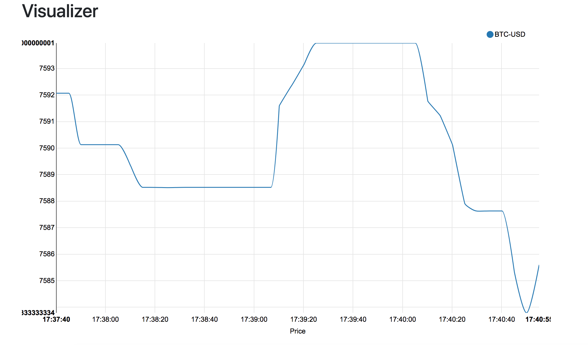

# Bitcoin Data Pipeline and Visulization


### Environment Setup
```
# under ./dataPipeline
virtualenv ENV
source ENV/bin/activate
pip install -r requirements.txt

# under ./node
npm install
```

### Run Programs
```
// run docker containers [For local machine test]
sh run_docker.sh

python dataPipeline/data_producer.py BTC-USD analyzer 127.0.0.1:9092

spark-submit --jars dataPipeline/spark-streaming-kafka-0-8-assembly_2.11-2.0.0.jar dataPipeline/data_stream.py analyzer average-price 127.0.0.1:9092 5

python dataPipeline/redis_publisher.py average-price 127.0.0.1:9092 price 127.0.0.1 6379

node node/index.js --redis_host=localhost --redis_port=6379 --redis_channel=price --port=3000

// localhost:3000
```


### Visulization

